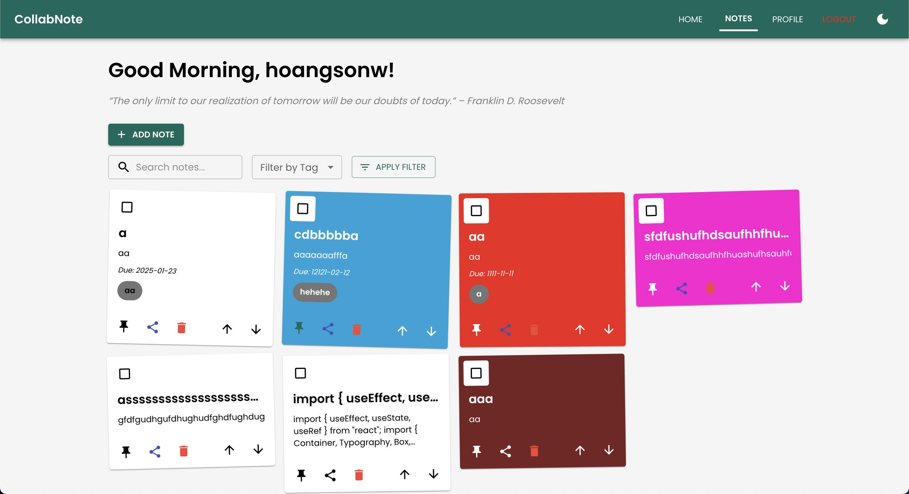
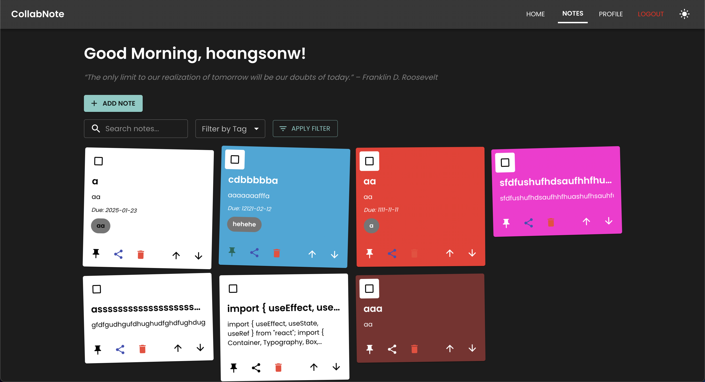

# CollabNote - A NestJS, Next.js, Vite, and Supabase Fullstack Notetaking App

[](https://nestjs.com/)
[](https://nextjs.org/)
[](https://vitejs.dev/)
[](https://supabase.io/)
[](https://www.postgresql.org/)
[](https://swagger.io/)
[](https://www.typescriptlang.org/)
[](https://www.docker.com/)
[](https://nginx.org/)
[](https://kubernetes.io/)
[](https://www.jenkins.io/)
[](https://ui.shadcn.dev/)

CollabNote is a collaborative notes platform designed to help you take, share, and manage notes effectively. It features a user-friendly interface, powerful backend APIs, and seamless deployment for both frontend and backend.

## Table of Contents
- [🚀 Features](#-features)
- [🚀 Deployment](#-deployment)
- [🎯 Tech Stack](#-tech-stack)
- [🖼️ UI Overview](#-ui-overview)
- [🛠️ Getting Started](#-getting-started)
  - [Prerequisites](#prerequisites)
  - [Installation](#installation)
  - [Running Locally](#running-locally)
  - [Using Docker](#using-docker)
- [📖 API Documentation](#-api-documentation)
  - [API Endpoints](#api-endpoints)
- [🧰 Nginx Configuration](#-nginx-configuration)
- [🌐 Kubernetes Deployment](#-kubernetes-deployment)
- [👨🏻‍💻 Continuous Integration and Deployment with Jenkins](#-continuous-integration-and-deployment-with-jenkins)
- [🧪 Testing](#-testing)
  - [Backend Tests](#backend-tests)
  - [Frontend Tests](#frontend-tests)
- [🤝 Contributing](#-contributing)
- [📄 License](#-license)
- [🎉 Acknowledgments](#-acknowledgments)

## 🚀 Features

- **Authentication**: Secure user login, registration, and password management.
- **Notes Management**: Create, update, delete, and reorder notes.
- **Sharing**: Share notes with other users seamlessly.
- **Search**: Search for notes by title or content.
- **User Profiles**: Manage and search user profiles.
- **Profile Settings**: Update user profile information.
- **Dark Mode**: Toggle between light and dark themes.
- **Testing**: Unit and integration tests for backend and frontend.
- **Responsive Design**: Works on all devices and screen sizes.
- **Swagger Documentation**: Comprehensive API documentation.

## 🚀 Deployment

The app is deployed on Vercel for the frontend. You can access the live app at [CollabNote](https://collabnote-app.vercel.app/).

Additionally, the backend API is deployed on Render. You can access the API documentation at [CollabNote API](hhttps://collabnote-fullstack-app.onrender.com/).

The backup frontend is also hosted on Netlify, which you can access at [CollabNote Netlify](https://notesapp-nestjs.netlify.app/).

> Note: The backend API may spin down due to inactivity. If you encounter any issues, please try again later. If inactive, the API may take a few seconds to start up, so frontend requests and Swagger may take some time to load initially.

## 🎯 Tech Stack

| Technology                                    | Description                         |
|-----------------------------------------------|-------------------------------------|
| [NestJS](https://nestjs.com/)                 | Backend framework for scalable APIs |
| [Next.js](https://nextjs.org/)                | React-based framework for SSR       |
| [React](https://reactjs.org/)                 | Frontend library for building UI    |
| [Vite](https://vitejs.dev/)                   | Frontend build tool                 |
| [Supabase](https://supabase.io/)              | Backend-as-a-service for auth & DB  |
| [PostgreSQL](https://www.postgresql.org/)     | Database for storing app data       |
| [TypeScript](https://www.typescriptlang.org/) | Type-safe development               |
| [Swagger](https://swagger.io/)                | API documentation and testing tool  |
| [ShadCN](https://ui.shadcn.dev/)              | UI components for a modern design   |


## 🖼️ UI Overview

### Home Page

<p align="center">
  
</p>

### Home Page - Dark Mode

<p align="center">
  
</p>

### Notes Dashboard

<p align="center">
  
</p>

### Notes Dashboard - Dark Mode

<p align="center">
  
</p>

### Add Note Modal

<p align="center">
  
</p>

### Note Details Modal

<p align="center">
  
</p>

### Note Editor

<p align="center">
  
</p>

### Profile Page

<p align="center">
  
</p>

### Profile Page - Dark Mode

<p align="center">
  
</p>

### Login Page

<p align="center">
  
</p>

### Login Page - Dark Mode

<p align="center">
  
</p>

### Register Page

<p align="center">
  
</p>

### Register Page - Dark Mode

<p align="center">
  
</p>

### Reset Password Page

<p align="center">
  
</p>

### Reset Password Page - Dark Mode

<p align="center">
  
</p>

### API Documentation

<p align="center">
  
</p>

## 🛠️ Getting Started

Follow these steps to set up the project on your local machine.

### Prerequisites

Ensure you have the following installed:
- **Node.js**: v18 or above
- **npm**: v9 or above
- **PostgreSQL**: v15 or above
- **Docker** (Optional)

### Installation

1. **Clone the Repository**:
   ```bash
   git clone https://github.com/hoangsonww/CollabNote-Fullstack-App.git
   cd CollabNote-Fullstack-App
   ```

2. **Set Up Backend**:
   ```bash
   cd backend
   npm install
   ```

3. **Set Up Frontend**:
   ```bash
   cd ../frontend
   npm install
   ```

4. **Configure Environment Variables**:
- Create `.env` files in the `backend` and `frontend` directories.
- For **backend** (`backend/.env`):
  ```env
  SUPABASE_URL=your_supabase_url
  SUPABASE_SERVICE_KEY=your_supabase_service_key
  JWT_SECRET=your_jwt_secret
  JWT_EXPIRES_IN=jwt_expiry_time(eg. 1d)
  PORT=4000
  ```
- For **frontend** (`frontend/.env`):
  ```env
  VITE_API_URL=http://localhost:4000
  ```

---

### Running Locally

1. **Start the Backend**:
   ```bash
   cd backend
   npm run start:dev
   ```

2. **Start the Frontend**:
   ```bash
   cd ../frontend
   npm run dev
   ```

3. Open your browser:
- **Frontend**: [http://localhost:5172](http://localhost:5172) or your selected Vite port
- **Backend**: [http://localhost:4000](http://localhost:4000)
- **Swagger**: [http://localhost:4000/api](http://localhost:4000/api)


### Using Docker

1. **Build and Run Docker Containers**:
   ```bash
   docker-compose up --build
   ```

2. **Access the Services**:
- Backend: [http://localhost:4000](http://localhost:4000)
- Frontend: [http://localhost:3000](http://localhost:3000)

## 📖 API Documentation

All APIs are documented in Swagger. Access the documentation at [http://localhost:4000/api](http://localhost:4000/api).

### API Endpoints

| Method | Endpoint                   | Description                               |
|--------|----------------------------|-------------------------------------------|
| POST   | `/auth/register`           | Register a new user                       |
| POST   | `/auth/login`              | Login an existing user                    |
| POST   | `/auth/check-email-exists` | Check if an email exists                  |
| POST   | `/auth/reset-password`     | Reset a user's password                   |
| GET    | `/notes`                   | Retrieve user notes                       |
| POST   | `/notes`                   | Create a new note                         |
| PATCH  | `/notes/{id}`              | Update a note                             |
| DELETE | `/notes/{id}`              | Delete a note                             |
| POST   | `/notes/{id}/share`        | Share a note with another user            |
| POST   | `/notes/reorder`           | Reorder user notes                        |
| GET    | `/profile/me`              | Retrieve the authenticated user's profile |
| GET    | `/profile/userId/{id}`     | Retrieve a user profile by ID             |
| GET    | `/profile/search`          | Search for a user profile by username     |

## **🧰 Nginx Configuration**

- The `nginx` directory contains an Nginx configuration for reverse proxy and load balancing.
- Use Nginx to route requests to multiple instances of the API.
- Configure SSL termination and caching for improved performance.
- The Nginx configuration looks like this:

```nginx
server {
    listen 80;
    server_name localhost;

    location / {
        proxy_pass http://localhost:3000;
        proxy_http_version 1.1;
        proxy_set_header Upgrade $http_upgrade;
        proxy_set_header Connection 'upgrade';
        proxy_set_header Host $host;
        proxy_cache_bypass $http_upgrade;
    }
}
```

- For more information, refer to the [Nginx documentation](https://nginx.org/en/docs/) and the [Nginx Directory](nginx/README.md).

## **🌐 Kubernetes Deployment**

1. Create Kubernetes manifests for the services.
2. Deploy to a cluster:
   ```bash
   kubectl apply -f kubernetes/
   ```

3. Access the application using the service URL.

## **👨🏻‍💻 Continuous Integration and Deployment with Jenkins**

The Budget Management API includes a Jenkins pipeline for continuous integration and deployment.

1. **Pipeline Configuration:** The `Jenkinsfile` defines the CI/CD pipeline stages, including code checkout, dependency installation, testing, building, and deployment. Add it to the root of the project.

2. **Job Setup:** Create a pipeline job in Jenkins, point it to the repository, and configure it to use the `Jenkinsfile`.

3. **Automated Testing:** The pipeline runs `npm test` to ensure all tests pass before proceeding to the build or deployment stages.

4. **Environment Variables:** Use Jenkins environment variables to securely manage secrets like API keys and credentials for services such as MongoDB, Redis, or Render.

5. **Deployment:** The pipeline supports deploying the application using Render or directly to a server using SSH and PM2.

6. **Webhooks:** Integrate GitHub/GitLab webhooks to trigger builds automatically on code changes.

7. **Notifications:** Add Slack or email notifications in the pipeline to inform team members about build and deployment statuses.

## 🧪 Testing

Run tests to ensure the app functions as expected.

### Backend Tests
```bash
cd backend
npm run test
```

### Frontend Tests
```bash
cd frontend
npm run test
```

## 🤝 Contributing

Contributions are welcome! Please fork the repository and create a pull request.

## 📄 License

This project is licensed under the [MIT License](https://opensource.org/licenses/MIT).

## 🎉 Acknowledgments

- **Son Nguyen**: Creator and maintainer of CollabNote.
- **NestJS, Next.js, React, Vite**: The tech stack that powers this project.

---

Thank you for visiting CollabNote today! Happy notetaking! 📝🚀

[🔝 Back to Top](#collabnote---a-nestjs-nextjs-vite-and-supabase-fullstack-notetaking-app)
