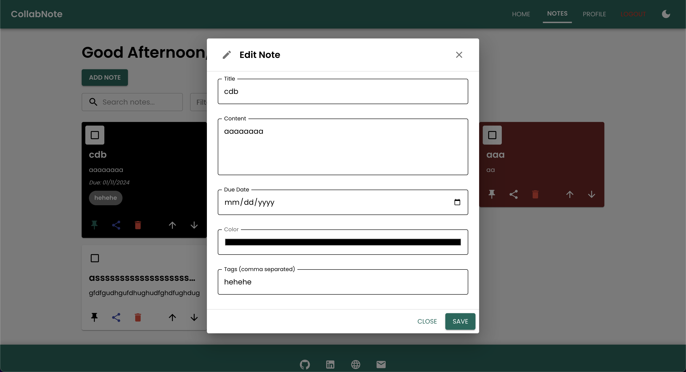
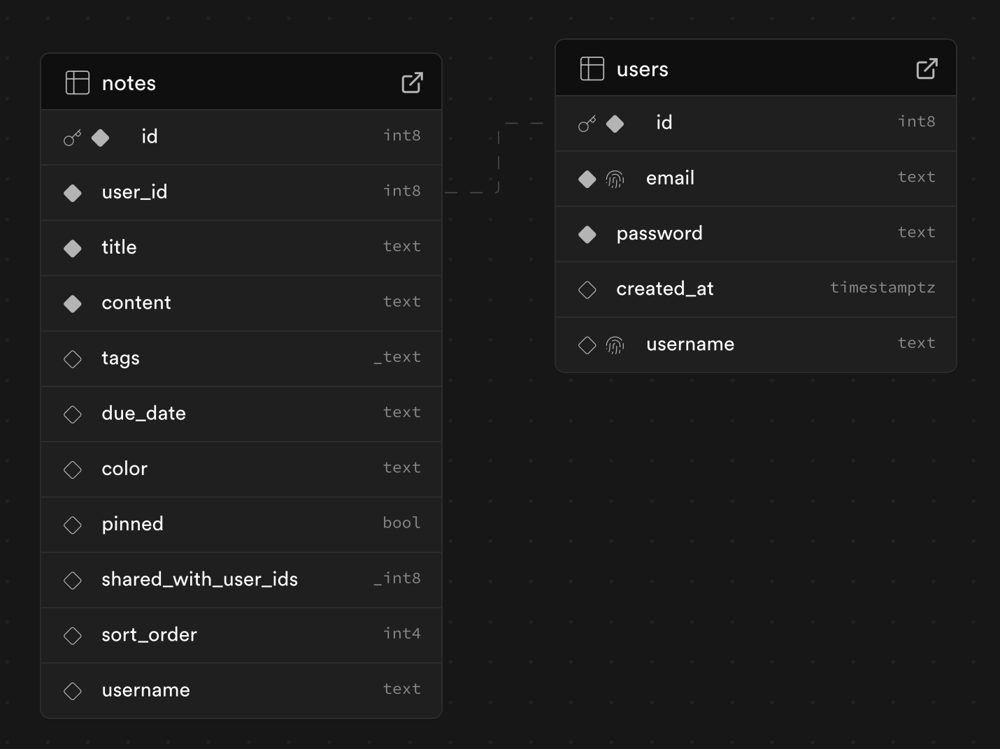
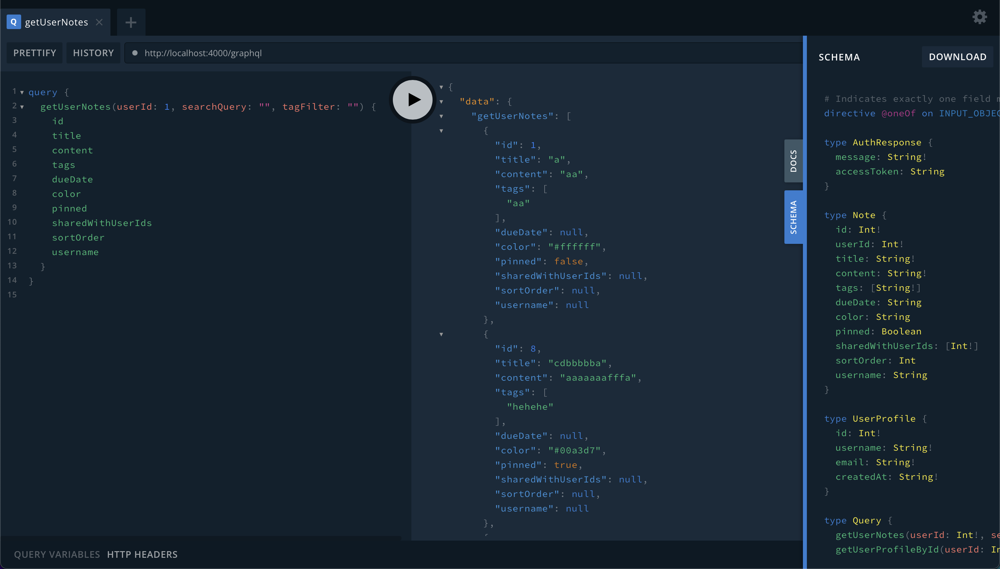

# CollabNote - A NestJS, Next.js, Vite, and Supabase Fullstack Notetaking App

[](https://nestjs.com/)
[](https://nextjs.org/)
[](https://reactjs.org/)
[](https://vitejs.dev/)
[](https://supabase.io/)
[](https://www.postgresql.org/)
[](https://mui.com/)
[](https://swagger.io/)
[](https://graphql.org/)
[](https://www.typescriptlang.org/)
[](https://www.docker.com/)
[](https://nginx.org/)
[](https://www.jenkins.io/)

CollabNote is a collaborative notes platform designed to help you take, share, and manage notes effectively. It features a user-friendly interface, powerful backend APIs, and seamless deployment for both frontend and backend.

## Table of Contents
- [💡 Features](#-features)
- [🚀 Deployment](#-deployment)
- [🎯 Tech Stack](#-tech-stack)
- [🖼️ UI Overview](#-ui-overview)
- [📂 Project Structure](#-project-structure)
- [🛠️ Getting Started](#-getting-started)
  - [Prerequisites](#prerequisites)
  - [Installation](#installation)
  - [Running Locally](#running-locally)
  - [Using Docker](#using-docker)
- [📖 API Documentation](#-api-documentation)
  - [API Endpoints](#api-endpoints)
  - [Database Schema](#database-schema)
  - [Detailed Guide for Using the `openapi.yaml` File](#detailed-guide-for-using-the-openapiyaml-file)
- [🖥️ GraphQL Integration](#-graphql-integration)
- [🧰 Nginx Configuration](#-nginx-configuration)
- [🌐 Kubernetes Deployment](#-kubernetes-deployment)
- [👨🏻‍💻 Continuous Integration and Deployment with Jenkins](#-continuous-integration-and-deployment-with-jenkins)
- [🧪 Testing](#-testing)
  - [Backend Tests](#backend-tests)
  - [Frontend Tests](#frontend-tests)
- [🤝 Contributing](#-contributing)
- [📄 License](#-license)
- [🎉 Acknowledgments](#-acknowledgments)

## 💡 Features

- **Authentication**: Secure user login, registration, and password management.
- **Notes Management**: Create, update, delete, and reorder notes.
- **Sharing**: Share notes with other users seamlessly.
- **Syncing**: Real-time syncing of notes across devices, and across users, thanks to Supabase.
- **Collaboration**: Collaborate with others on notes in real-time.
- **Search**: Search for notes by title or content.
- **User Profiles**: Manage and search user profiles.
- **Profile Settings**: Update user profile information.
- **Dark Mode**: Toggle between light and dark themes.
- **Testing**: Unit and integration tests for backend and frontend.
- **Responsive Design**: Works on all devices and screen sizes.
- **Swagger Documentation**: Comprehensive API documentation.
- **CI/CD Pipeline**: Jenkins pipeline for automated testing and deployment.

## 🚀 Deployment

The app is deployed on Vercel for the frontend. You can access the live app at [CollabNote](https://collabnote-app.vercel.app/).

Additionally, the backend API is deployed on Render. You can access the API documentation at [CollabNote API](https://collabnote-fullstack-app.onrender.com/).

The backup frontend is also hosted on Netlify, which you can access at [CollabNote Netlify](https://notesapp-nestjs.netlify.app/).

> Note: The backend API may spin down due to inactivity. If you encounter any issues, please try again later. If inactive, the API may take a few seconds to start up, so frontend requests and Swagger may take some time to load initially.

> Important: Supabase may pause the app's database if it exceeds the free tier limits. Thus, if you are unable to log in or register, [let me know](mailto:hoangson091104@gmail.com) and I will re-enable it (and it may take a while...)

## 🎯 Tech Stack

| Technology                                    | Description                         |
|-----------------------------------------------|-------------------------------------|
| [NestJS](https://nestjs.com/)                 | Backend framework for scalable APIs |
| [Next.js](https://nextjs.org/)                | React-based framework for SSR       |
| [React](https://reactjs.org/)                 | Frontend library for building UI    |
| [Vite](https://vitejs.dev/)                   | Frontend build tool                 |
| [Supabase](https://supabase.io/)              | Backend-as-a-service for auth & DB  |
| [PostgreSQL](https://www.postgresql.org/)     | Database for storing app data       |
| [TypeScript](https://www.typescriptlang.org/) | Type-safe development               |
| [Swagger](https://swagger.io/)                | API documentation and testing tool  |
| [Docker](https://www.docker.com/)             | Containerization for apps           |
| [Nginx](https://nginx.org/)                   | Web server for load balancing       |
| [Jenkins](https://www.jenkins.io/)            | CI/CD tool for automated testing    |
| [Render](https://render.com/)                 | Cloud platform for hosting apps     |
| [Vercel](https://vercel.com/)                 | Cloud platform for frontend hosting |
| [GraphQL](https://graphql.org/)               | Query language for APIs             |

## 🖼️ UI Overview

### Home Page

<p align="center">
  
</p>

### Home Page - Dark Mode

<p align="center">
  
</p>

### Notes Dashboard

<p align="center">
  
</p>

### Notes Dashboard - Dark Mode

<p align="center">
  
</p>

### Add Note Modal

<p align="center">
  
</p>

### Note Details Modal

<p align="center">
  
</p>

### Note Editor

<p align="center">
  
</p>

### Profile Page

<p align="center">
  
</p>

### Profile Page - Dark Mode

<p align="center">
  
</p>

### Login Page

<p align="center">
  
</p>

### Login Page - Dark Mode

<p align="center">
  
</p>

### Register Page

<p align="center">
  
</p>

### Register Page - Dark Mode

<p align="center">
  
</p>

### Reset Password Page

<p align="center">
  
</p>

### Reset Password Page - Dark Mode

<p align="center">
  
</p>

### API Documentation

<p align="center">
  
</p>

## 📂 Project Structure

```
DocuThinker-AI-App/
├── backend/
│   ├── src/
│   │   ├── auth/
│   │   │   ├── auth.module.ts        # Authentication module
│   │   │   ├── auth.controller.ts    # Authentication controller
│   │   │   ├── auth.service.ts       # Authentication service
│   │   │   ├── auth.schema.ts        # Authentication schema
│   │   │   ├── auth.resolver.ts      # Authentication resolver
│   │   │   └── jwt.strategy.ts       # JWT authentication strategy
│   │   ├── dto/
│   │   │   ├── create-note.input.ts  # Create note DTO
│   │   │   └── update-note.input.ts  # Update note DTO
│   │   ├── notes/
│   │   │   ├── notes.schema.ts       # Notes schema
│   │   │   ├── notes.resolver.ts     # Notes resolver
│   │   │   ├── notes.module.ts       # Notes module
│   │   │   ├── notes.controller.ts   # Notes controller
│   │   │   └── notes.service.ts      # Notes service
│   │   ├── profile/
│   │   │   ├── profile.schema.ts     # Profile schema
│   │   │   ├── profile.resolver.ts   # Profile resolver
│   │   │   ├── profile.module.ts     # Profile module
│   │   │   ├── profile.controller.ts # Profile controller
│   │   │   └── profile.service.ts    # Profile service
│   │   ├── supabase/
│   │   │   ├── supabase.module.ts    # Supabase module
│   │   │   └── supabase.service.ts   # Supabase service
│   │   ├── types/
│   │   │   └── authenticated-request.ts  # Authenticated user type
│   │   ├── schema.gql                # GraphQL schema 
│   │   ├── app.module.ts             # Main app module
│   │   ├── app.test.ts               # App test file
│   │   └── main.ts                   # Main entry point for the backend
│   ├── .env                          # Environment variables (git-ignored)
│   ├── build-backend.sh              # Shell script to build the backend
│   ├── Dockerfile                    # Docker configuration file
│   ├── docker-compose.yml            # Docker Compose file for the backend
│   ├── package.json                  # Project dependencies and scripts
│   ├── package-lock.json             # Lock file for dependencies
│   ├── tsconfig.json                 # TypeScript configuration file
│   └── vercel.json                   # Vercel configuration file
│
├── frontend/
│   ├── public/
│   │   ├── favicon.ico               # Favicon for the app
│   │   ├── (other images...)         # Other images used in the app
│   │   ├── index.html                # Main HTML template
│   │   └── manifest.json             # Manifest for PWA settings
│   ├── src/
│   │   ├── assets/                   # Static assets like images and fonts
│   │   │   └── logo.png              # App logo or images
│   │   ├── components/
│   │   │   ├── LoadingOverlay.tsx    # Loading overlay component
│   │   │   └── PasswordField.tsx     # Password field component
│   │   ├── layout/
│   │   │   ├── ResponsiveDrawer.tsx  # Responsive drawer component
│   │   │   ├── Footer.tsx            # Footer component
│   │   │   ├── Layout.tsx            # Main layout component
│   │   │   └── Navbar.tsx            # Navbar component
│   │   ├── routes/
│   │   │   ├── ForgotPasswordPage.tsx   # Forgot password page
│   │   │   ├── HomePage.tsx          # Home page
│   │   │   ├── LoginPage.tsx         # Login page
│   │   │   ├── NoteDetailsPage.tsx   # Note details page
│   │   │   ├── NotesPage.tsx         # Notes dashboard page
│   │   │   ├── ProfilePage.tsx       # Profile page
│   │   │   └── RegisterPage.tsx      # Register page
│   │   ├── theme/
│   │   │   ├── index.ts              # Theme configuration
│   │   │   ├── ThemeContext.tsx      # Theme context provider
│   │   │   └── ThemeProviderWrapper.tsx  # Theme provider wrapper
│   │   ├── App.tsx                   # Main App component
│   │   ├── App.test.tsx              # App test file
│   │   ├── App.css                   # Global CSS 1
│   │   ├── index.css                 # Global CSS 2
│   │   ├── main.tsx                  # Main entry point for the frontend
│   │   └── vite-env.d.ts             # Vite environment types
│   ├── .gitignore                    # Git ignore file
│   ├── package.json                  # Project dependencies and scripts
│   ├── package-lock.json             # Lock file for dependencies
│   ├── Dockerfile                    # Docker configuration file
│   ├── docker-compose.yml            # Docker Compose file for the frontend
│   ├── index.html                    # Main HTML template
│   ├── build-frontend.sh             # Shell script to build the frontend
│   ├── vercel.json                   # Vercel configuration file
│   ├── vite.config.ts                # Vite configuration file
│   ├── tsconfig.app.json             # TypeScript configuration file for the app
│   ├── tsconfig.node.json            # TypeScript configuration file for Node
│   └── tsconfig.json                 # TypeScript configuration file
│
├── kubernetes/                       # Kubernetes configuration files
│   ├── backend-deployment.yaml       # Deployment configuration for the backend
│   ├── backend-service.yaml          # Service configuration for the backend
│   ├── frontend-deployment.yaml      # Deployment configuration for the frontend
│   ├── frontend-service.yaml         # Service configuration for the frontend
│   └── configmap.yaml                # ConfigMap configuration for environment variables
│
├── nginx/
│   ├── start_nginx.sh                # Shell script to start NGINX
│   ├── nginx.conf                    # NGINX configuration file for load balancing and caching
│   ├── docker-compose.yml            # Docker Compose file for NGINX
│   └── Dockerfile                    # Docker configuration file for NGINX
│
├── images/                           # Images for the README
├── .env                              # Environment variables file for the whole app
├── docker-compose.yml                # Docker Compose file for containerization
├── package.json                      # Project dependencies and scripts
├── package-lock.json                 # Lock file for dependencies
├── vercel.json                       # Vercel configuration file
├── openapi.yaml                      # OpenAPI specification for API documentation
├── jenkins_cicd.sh                   # Shell script for managing the Jenkins CI/CD pipeline
├── .gitignore                        # Git ignore file
├── LICENSE                           # License file for the project
├── README.md                         # Comprehensive README for the whole app
└── (and many more files...)          # Additional files and directories not listed here
```

## 🛠️ Getting Started

Follow these steps to set up the project on your local machine.

### Prerequisites

Ensure you have the following installed:
- **Node.js**: v18 or above
- **npm**: v9 or above
- **PostgreSQL**: v15 or above
- **Docker** (Optional)

### Installation

1. **Clone the Repository**:
   ```bash
   git clone https://github.com/hoangsonww/CollabNote-Fullstack-App.git
   cd CollabNote-Fullstack-App
   ```

2. **Set Up Backend**:
   ```bash
   cd backend
   npm install
   ```

3. **Set Up Frontend**:
   ```bash
   cd ../frontend
   npm install
   ```

4. **Configure Environment Variables**:
- Create `.env` files in the `backend` and `frontend` directories.
- For **backend** (`backend/.env`):
  ```env
  SUPABASE_URL=your_supabase_url
  SUPABASE_SERVICE_KEY=your_supabase_service_key
  JWT_SECRET=your_jwt_secret
  JWT_EXPIRES_IN=jwt_expiry_time(eg. 1d)
  PORT=4000
  ```
- For **frontend** (`frontend/.env`):
  ```env
  VITE_API_URL=http://localhost:4000
  ```

### Running Locally

1. **Start the Backend**:
   ```bash
   cd backend
   npm run start:dev
   ```

2. **Start the Frontend**:
   ```bash
   cd ../frontend
   npm run dev
   ```

3. Open your browser:
- **Frontend**: [http://localhost:5172](http://localhost:5172) or your selected Vite port
- **Backend**: [http://localhost:4000](http://localhost:4000)
- **Swagger**: [http://localhost:4000/api](http://localhost:4000/api)

### Using Docker

1. **Build and Run Docker Containers**:
   ```bash
   docker-compose up --build
   ```

2. **Access the Services**:
- Backend: [http://localhost:4000](http://localhost:4000)
- Frontend: [http://localhost:3000](http://localhost:3000)

## 📖 API Documentation

All APIs are documented in Swagger. Access the documentation at [http://localhost:4000/api](http://localhost:4000/api).

### API Endpoints

| Method | Endpoint                   | Description                               |
|--------|----------------------------|-------------------------------------------|
| POST   | `/auth/register`           | Register a new user                       |
| POST   | `/auth/login`              | Login an existing user                    |
| POST   | `/auth/check-email-exists` | Check if an email exists                  |
| POST   | `/auth/reset-password`     | Reset a user's password                   |
| GET    | `/notes`                   | Retrieve user notes                       |
| POST   | `/notes`                   | Create a new note                         |
| PATCH  | `/notes/{id}`              | Update a note                             |
| DELETE | `/notes/{id}`              | Delete a note                             |
| POST   | `/notes/{id}/share`        | Share a note with another user            |
| POST   | `/notes/reorder`           | Reorder user notes                        |
| GET    | `/profile/me`              | Retrieve the authenticated user's profile |
| GET    | `/profile/userId/{id}`     | Retrieve a user profile by ID             |
| GET    | `/profile/search`          | Search for a user profile by username     |
| PATCH  | `/profile/me`              | Update the authenticated user's profile   |

### Database Schema

The database schema consists of the following tables:

<p align="center">
  
</p>

Note the `user_id` foreign key relationship between the `notes` and `users` tables. Additionally, more tables will be added as the app grows in the future!

### Detailed Guide for Using the `openapi.yaml` File

1. **View the API Documentation**

- Open [Swagger Editor](https://editor.swagger.io/).
- Upload the `openapi.yaml` file or paste its content.
- Visualize and interact with the API documentation.

2. **Test the API**

- Import `openapi.yaml` into [Postman](https://www.postman.com/):
  - Open Postman → Import → Select `openapi.yaml`.
  - Test the API endpoints directly from Postman.
- Or use [Swagger UI](https://swagger.io/tools/swagger-ui/):
  - Provide the file URL or upload it to view and test endpoints.

3. **Generate Client Libraries**

- Install OpenAPI Generator:
  ```bash
  npm install @openapitools/openapi-generator-cli -g
  ```
- Generate a client library:
  ```bash
  openapi-generator-cli generate -i openapi.yaml -g <language> -o ./client
  ```
- Replace `<language>` with the desired programming language.

4. **Generate Server Stubs**

- Generate a server stub:
  ```bash
  openapi-generator-cli generate -i openapi.yaml -g <framework> -o ./server
  ```
- Replace `<framework>` with the desired framework.

5. **Run a Mock Server**

- Install Prism:
  ```bash
  npm install -g @stoplight/prism-cli
  ```
- Start the mock server:
  ```bash
  prism mock openapi.yaml
  ```

6. **Validate the OpenAPI File**

- Use [Swagger Validator](https://validator.swagger.io/):
  - Upload `openapi.yaml` or paste its content to check for errors.

This guide enables you to view, test, and utilize the API.

## **🖥️ GraphQL Integration**

The CollabNote API also supports GraphQL for querying and manipulating data.

To access, navigate to [https://collabnote-fullstack-app.onrender.com/graphql](https://collabnote-fullstack-app.onrender.com/graphql) and use the GraphQL Playground to interact with the API.

Alternatively, you can start a local backend server following the steps above and access the GraphQL Playground at [http://localhost:4000/graphql](http://localhost:4000/graphql).

You should see something like this:

<p align="center">
  
</p>

You can query something like this:

```graphql
query {
  getUserNotes(userId: 1, searchQuery: "", tagFilter: "") {
    id
    title
    content
    tags
    dueDate
    color
    pinned
    sharedWithUserIds
    sortOrder
    username
  }
}
```

This query fetches all notes for a user with ID 1. You can modify the query to suit your needs.

Feel free to explore the GraphQL API and test different queries and mutations! Consult the [GraphQL documentation](https://graphql.org/learn/) for more information.

## **🧰 Nginx Configuration**

- The `nginx` directory contains an Nginx configuration for reverse proxy and load balancing.
- Use Nginx to route requests to multiple instances of the API.
- Configure SSL termination and caching for improved performance.
- The Nginx configuration looks like this:

```nginx
server {
    listen 80;
    server_name localhost;

    location / {
        proxy_pass http://localhost:3000;
        proxy_http_version 1.1;
        proxy_set_header Upgrade $http_upgrade;
        proxy_set_header Connection 'upgrade';
        proxy_set_header Host $host;
        proxy_cache_bypass $http_upgrade;
    }
}
```

- For more information, refer to the [Nginx documentation](https://nginx.org/en/docs/) and the [Nginx Directory](nginx/README.md).

## **🌐 Kubernetes Deployment**

1. Create Kubernetes manifests for the services.
2. Deploy to a cluster:
   ```bash
   kubectl apply -f kubernetes/
   ```

3. Access the application using the service URL.

## **👨🏻‍💻 Continuous Integration and Deployment with Jenkins**

The CollabNote API also includes a Jenkins pipeline for continuous integration and deployment.

1. **Pipeline Configuration:** The `Jenkinsfile` defines the CI/CD pipeline stages, including code checkout, dependency installation, testing, building, and deployment. Add it to the root of the project.

2. **Job Setup:** Create a pipeline job in Jenkins, point it to the repository, and configure it to use the `Jenkinsfile`.

3. **Automated Testing:** The pipeline runs `npm test` to ensure all tests pass before proceeding to the build or deployment stages.

4. **Environment Variables:** Use Jenkins environment variables to securely manage secrets like API keys and credentials for services such as MongoDB, Redis, or Render.

5. **Deployment:** The pipeline supports deploying the application using Render or directly to a server using SSH and PM2.

6. **Webhooks:** Integrate GitHub/GitLab webhooks to trigger builds automatically on code changes.

7. **Notifications:** Add Slack or email notifications in the pipeline to inform team members about build and deployment statuses.

## 🧪 Testing

We also feature Jest unit and integration tests for both the backend and frontend. Run the tests to ensure the app functions as expected.

### Backend Tests
```bash
cd backend
npm run test
```

### Frontend Tests
```bash
cd frontend
npm run test
```

## 🤝 Contributing

Contributions are welcome! Please fork the repository and create a pull request.

## 📄 License

This project is licensed under the [MIT License](https://opensource.org/licenses/MIT).

## 🎉 Acknowledgments

- **Son Nguyen**: Creator and maintainer of CollabNote.
- **NestJS, Next.js, React, Vite**: The tech stack that powers this project.

---

Thank you for visiting CollabNote today! **Happy notetaking!** 📝🚀

[🔝 Back to Top](#collabnote---a-nestjs-nextjs-vite-and-supabase-fullstack-notetaking-app)
